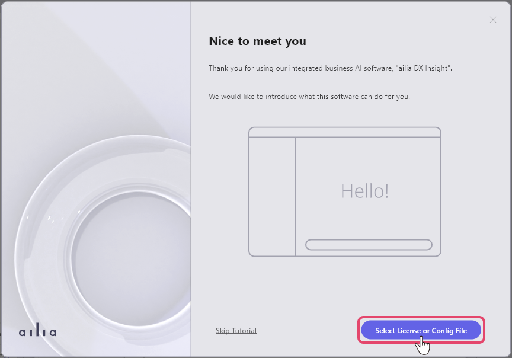
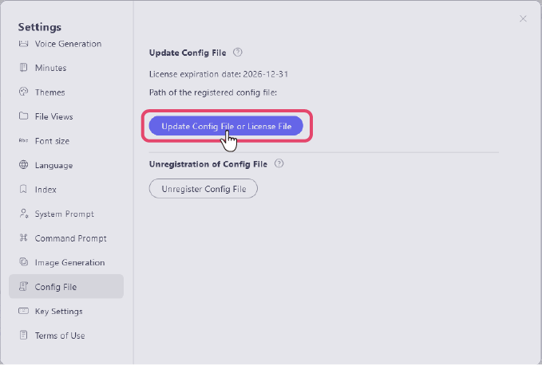
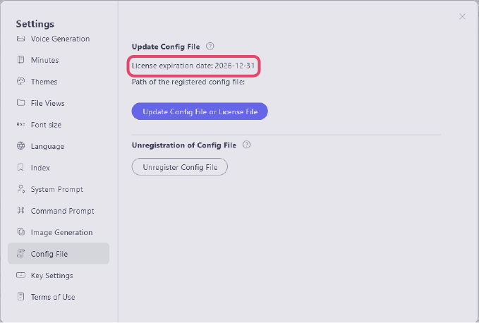

# Creating a Config File
By creating a config file, you can display the terms image when starting the application or always display the company logo.<br>


<br>

## Example of Creating a Config File
Create the config format in json.

```
{
  "apiKey" : {
    "openAI": "YourOpenAIApiKey"
  },
  "licenseFile": "/path/to/license/file",
  "terms": {
    "image": "/path/to/terms/image"
  },
  "logo": "path/to/logo/image"
}
```

`"apiKey"`<br>
Enter the OpenAI API key here.<br>
`"licenseFile"`<br>
Specify the path to the license file as a relative path from the config file.<br>
`"terms"` `"logo"`<br>
Specify the path to the image file as a relative path from the config file.

Other than the license file item, the omission of items does not affect the startup of the app.

Please place the created configuration file in a shared folder within your company.<br>
Since settings and image files are copied locally, access to the shared folder after initial setup is not required.

## Applying the Config File / Applying the License
When ailia DX Insight is launched for the first time, a window will appear asking you to "Select License or Config Fiile" Please specify the folder to apply.<br>
<br>
<br> Alternatively, you can register/update the license within the "Config File" item in the settings screen .<br> You can also unregister the config file within the same item.<br> 
<br>

## Checking the Expiration Date of the License File<div id=update07></div>
You can check the validity period of the license within the "Config File" item on the settings screen. <br>
<br>

<br>

#### [Next&emsp;＞](UseAI.md)